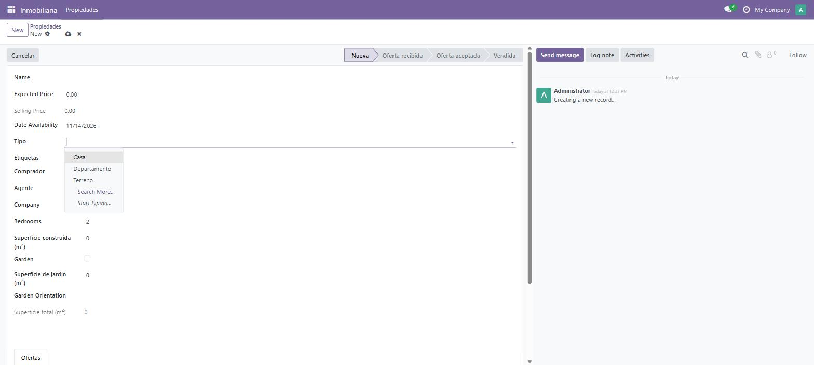

# Día 20 — Import/Export de datos y data files

**Semana:** 3 — Frontend, reportes e integraciones
**Duración estimada:** 3–4 h

## Objetivo del día
Cargar datos iniciales del módulo vía XML, y entender la portabilidad real entre bases de datos.



---

## Conceptos de Odoo

### `noupdate="1"`: carga única, no "protección de solo lectura"
Un archivo XML con `<odoo noupdate="1">` (o el atributo puesto en registros individuales) se procesa **solo la primera vez** que el módulo se instala. En actualizaciones posteriores (`-u`), Odoo lo ignora por completo — ni lo vuelve a crear, ni lo sincroniza, ni lo borra si vos lo borraste del XML. Esto es distinto de "el usuario no puede editarlo": un registro cargado con `noupdate="1"` es perfectamente editable desde la UI después — lo único que cambia es que una actualización del módulo no lo va a pisar con el valor original del XML.

### Por qué existe esta distinción
Pensá en los 3 tipos de propiedad del ejercicio de hoy: son una configuración inicial razonable, pero el usuario real de tu módulo probablemente va a querer agregar, renombrar o borrar tipos según su negocio. Si esos registros se resincronizaran en cada actualización (`noupdate="0"`, el comportamiento por defecto), cualquier cambio que el usuario hiciera se **perdería** en la próxima actualización del módulo. `noupdate="1"` es la forma de decir "esto es solo un punto de partida, después es del usuario".

### El external id es la verdadera clave primaria portable
El `id` numérico de un registro (`42`, `107`) es un detalle de implementación de **esa base de datos específica** — no significa nada en otra instancia. El external id (formato `modulo.identificador`, guardado en la tabla `ir.model.data`) es lo que Odoo usa internamente para poder decir "este registro del XML ya existe, no lo dupliques" en sucesivas actualizaciones, y es lo que hace posible referenciar un registro desde otro módulo con `ref="modulo.identificador"` sin conocer su id numérico.

### Import desde la UI: dos formas de referenciar relaciones
Al importar un CSV con una columna que apunta a otro modelo (por ejemplo, `property_type_id`), Odoo acepta:
- El **nombre visible** del registro relacionado (`property_type_id` = "Casa") — Odoo busca por `display_name`, ambiguo si hay duplicados.
- El **external id** con la sintaxis `property_type_id/id` = `gestion_inmobiliaria.property_type_house` — sin ambigüedad, pero requiere que ese external id exista.

La segunda forma es la única confiable para datos que vas a re-importar en múltiples entornos.

---

## Ejercicios prácticos

### Ejercicio 1 — Datos iniciales vía XML (guiado)

`data/inmueble_property_type_data.xml`:
```xml
<odoo noupdate="1">
    <record id="property_type_house" model="inmueble.property.type">
        <field name="name">Casa</field>
    </record>
    <record id="property_type_apartment" model="inmueble.property.type">
        <field name="name">Departamento</field>
    </record>
    <record id="property_type_land" model="inmueble.property.type">
        <field name="name">Terreno</field>
    </record>
</odoo>
```
Agregalo a `data`, actualizá el módulo, confirmá que aparecen los 3 tipos.

### Ejercicio 2 — Confirmar que `noupdate="1"` no resincroniza
1. Desde la UI, renombrá "Casa" a "Casa Familiar".
2. Actualizá el módulo de nuevo (`-u gestion_inmobiliaria`).
3. Confirmá que el nombre sigue siendo "Casa Familiar" — la actualización no lo pisó de vuelta a "Casa", porque `noupdate="1"` hace que Odoo ignore ese registro en actualizaciones posteriores.

### Ejercicio 3 — Ver el external id en la práctica
1. Con modo desarrollador activo, abrí el tipo "Casa Familiar" y andá a `Ver → Ver Metadatos` (o el menú equivalente de metadatos técnicos).
2. Confirmá que ves el external id `gestion_inmobiliaria.property_type_house`.
3. Desde `odoo shell`, confirmá que podés resolverlo así:
   ```python
   env.ref("gestion_inmobiliaria.property_type_house").name
   ```

### Ejercicio 4 — Exportar e importar por CSV
1. Desde la UI, exportá tus propiedades a CSV (`Acción → Exportar`), incluyendo el campo `property_type_id`.
2. Abrí el CSV y observá qué valor quedó para `property_type_id` (probablemente el nombre visible, no el external id).
3. Importá ese mismo CSV en la misma base (como registros nuevos) y confirmá que la relación con el tipo se resuelve igual por nombre.

### Ejercicio 5 — Reto: portabilidad real entre bases
1. Recreá una base de datos nueva (`midb2`) e instalá el módulo ahí también (con lo cual los 3 tipos de propiedad se cargan de cero, con los mismos external ids).
2. Exportá desde `midb` un CSV de propiedades, pero esta vez con la columna como `property_type_id/id` (usando el external id en vez del nombre) — para esto puede que necesites armar el CSV manualmente o usar la opción de exportación "compatible con importación" con external ids.
3. Importá ese CSV en `midb2` y confirmá que la relación se resuelve correctamente por external id, sin ambigüedad, aunque los `id` numéricos de las tablas sean distintos entre ambas bases.

---

## Preguntas de repaso conceptual

1. ¿Qué significa exactamente `noupdate="1"` — impide que el usuario edite el registro, o impide que una actualización del módulo lo resincronice?
2. ¿Por qué un `id` numérico no es una forma confiable de referenciar un registro entre dos bases de datos distintas?
3. ¿Dónde guarda Odoo la relación entre un external id y el `id` numérico real de un registro?
4. Al importar un CSV con una columna que apunta a otro modelo, ¿qué dos formas tenés de referenciar el registro relacionado, y cuál es más confiable?
5. Si borrás un registro de un archivo XML con `noupdate="1"` después de que el módulo ya fue instalado, ¿qué pasa con ese registro en las bases donde ya se instaló, al actualizar?

<details>
<summary>Ver respuestas</summary>

1. Impide que una actualización del módulo (`-u`) resincronice ese registro con el valor original del XML — el usuario puede seguir editándolo libremente desde la UI sin ninguna restricción especial.
2. Porque el `id` numérico es autoincremental y específico de cada base de datos: el registro con `id=42` en una base puede no existir, o ser algo completamente distinto, en otra base.
3. En la tabla `ir.model.data`, que mapea cada external id (`modulo.identificador`) al `id` numérico real del registro en su tabla correspondiente.
4. El nombre visible (`display_name`, ambiguo si hay duplicados) o el external id con sintaxis `campo/id` (sin ambigüedad, siempre que el external id exista). La segunda es la confiable para reimportar en múltiples entornos.
5. Nada — como el archivo tiene `noupdate="1"`, Odoo ni siquiera vuelve a mirar ese archivo en actualizaciones posteriores; el registro permanece intacto en las bases donde ya existía, aunque ya no esté declarado en el XML actual.

</details>

## Checklist de cierre
- [ ] Entiendo qué significa `noupdate="1"` en la práctica, y lo confirmé editando y reactualizando.
- [ ] Sé por qué un external id es más confiable que un id numérico para portar datos.
- [ ] Encontré el external id de un registro propio usando los metadatos técnicos.
- [ ] Probé exportar e importar, incluyendo el caso entre dos bases distintas.
