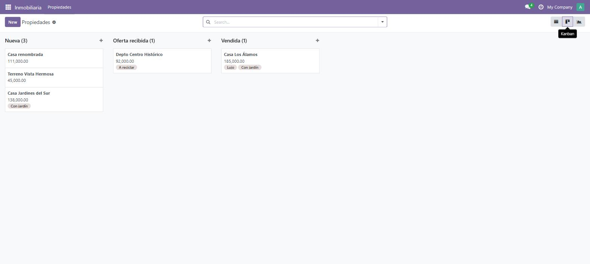

# Día 16 — Vistas avanzadas

**Semana:** 3 — Frontend, reportes e integraciones
**Duración estimada:** 3–4 h

## Objetivo del día
Agregar una vista Kanban de propiedades agrupada por estado, y explorar Graph/Pivot.



---

## Conceptos de Odoo

### Kanban no es "una lista con estilo": es una vista con agrupamiento como ciudadano de primera clase
En una vista `<list>`, agrupar es opcional y accesorio. En Kanban, el agrupamiento (`default_group_by`) es central al propósito de la vista: cada grupo se convierte en una **columna**, y (si el campo de agrupamiento es un `Selection` o `Many2one` editable) arrastrar una tarjeta entre columnas puede disparar automáticamente un cambio de ese campo en el registro — sin escribir código adicional, si el campo lo permite.

### La estructura `<templates><t t-name="card">`
Todo el contenido visual de cada tarjeta se define una sola vez dentro de `<t t-name="card">`, usando los mismos campos que declararías en cualquier otra vista (Odoo necesita que los campos usados estén declarados como `<field>` en algún punto de la vista para poder cargarlos, aunque el layout visual dentro del template use HTML normal). Es, en esencia, una mini-plantilla QWeb embebida dentro de la definición de la vista.

### Decoraciones condicionales en `<list>`
`decoration-danger="condición"`, `decoration-success="condición"`, etc. son atributos que Odoo interpreta para aplicar una clase CSS de color a toda la fila si la condición (expresión Python sobre el registro) se cumple. Es la forma declarativa de "resaltar visualmente ciertas filas" sin necesidad de un widget JS custom.

### Graph y Pivot: dos formas de ver el mismo tipo de dato
Ambas trabajan con **medidas** (campos numéricos, `type="measure"`) agrupadas por **dimensiones** (campos categóricos, `type="row"` o `type="col"`). La diferencia es de presentación: Graph muestra gráficos (barras, líneas, torta); Pivot muestra una tabla cruzada dinámica, más apta para explorar números exactos y reorganizar agrupamientos interactivamente. Ambas se alimentan del mismo mecanismo de agregación (similar a `read_group`) — no traen los registros individuales al cliente, traen sumas/promedios ya calculados.

### `view_mode` como lista ordenada de prioridad, otra vez
Igual que viste el día 4 con `list,form`, agregar `kanban` al `view_mode` de la acción (`list,kanban,form`) simplemente agrega esa vista como opción navegable — el usuario elige cuál ver con los botones de cambio de vista, sin que necesites acciones separadas por cada tipo de vista.

---

## Ejercicios prácticos

### Ejercicio 1 — Kanban agrupado por estado (guiado)

```xml
<record id="view_inmueble_property_kanban" model="ir.ui.view">
    <field name="name">inmueble.property.kanban</field>
    <field name="model">inmueble.property</field>
    <field name="arch" type="xml">
        <kanban default_group_by="state">
            <templates>
                <t t-name="card">
                    <div class="oe_kanban_card">
                        <strong><field name="name"/></strong>
                        <div><field name="expected_price"/></div>
                        <field name="tag_ids" widget="many2many_tags"/>
                    </div>
                </t>
            </templates>
        </kanban>
    </field>
</record>
```
Agregá `kanban` al `view_mode` de la acción (`list,kanban,form`), actualizá el módulo, y confirmá que agrupa por estado y que se puede arrastrar entre columnas.

### Ejercicio 2 — Decoraciones condicionales en la lista
1. En la vista `<list>` del día 4, agregá `decoration-success="state == 'sold'"` y `decoration-muted="state == 'cancelled'"` al elemento `<list>`.
2. Actualizá y confirmá visualmente que las filas cambian de color según el estado.

### Ejercicio 3 — Vista Graph
```xml
<record id="view_inmueble_property_graph" model="ir.ui.view">
    <field name="name">inmueble.property.graph</field>
    <field name="model">inmueble.property</field>
    <field name="arch" type="xml">
        <graph>
            <field name="property_type_id" type="row"/>
            <field name="expected_price" type="measure"/>
        </graph>
    </field>
</record>
```
Agregala a `data`, sumá `graph` al `view_mode`, y comparé el precio promedio/total por tipo de propiedad. Probá cambiar el tipo de gráfico (barras/líneas/torta) desde la UI.

### Ejercicio 4 — Vista Pivot sobre el mismo dato
1. Creá una vista Pivot equivalente (mismo modelo, mismos campos como medida/dimensión).
2. Compará: ¿qué podés hacer en Pivot que no podías en Graph (por ejemplo, reorganizar filas/columnas interactivamente, ver números exactos)?

### Ejercicio 5 — Reto: Kanban con quick-add deshabilitado y agrupamiento editable
- Confirmá que arrastrar una tarjeta de la columna "Nueva" a la columna "Vendida" en el Kanban efectivamente cambia el `state` del registro (porque `state` es el campo de `default_group_by` y es editable).
- Investigá el atributo `group_create="false"` en `<kanban>` y agregalo — confirmá que ya no se puede crear una columna nueva arrastrando o desde el "+" del Kanban (tiene sentido acá porque los estados son fijos, no user-defined).

---

## Preguntas de repaso conceptual

1. ¿Qué diferencia de propósito hay entre agrupar en una vista `<list>` y el `default_group_by` de un Kanban?
2. ¿Qué pasa si arrastrás una tarjeta Kanban a otra columna, cuando el campo de agrupamiento es editable?
3. ¿Qué controla `decoration-success="condición"` en una vista `<list>`?
4. ¿Cuál es la diferencia de propósito entre Graph y Pivot, dado que ambos trabajan con las mismas medidas y dimensiones?
5. Al agregar `kanban` a `view_mode`, ¿estás creando una acción nueva o simplemente ampliando las vistas navegables de la acción existente?

<details>
<summary>Ver respuestas</summary>

1. En una lista, agrupar es un filtro/organización opcional sobre una tabla; en Kanban, el agrupamiento define directamente las columnas visuales de la vista — es central, no accesorio.
2. Si el campo de agrupamiento lo permite (es editable, como un `Selection` o `Many2one`), Odoo actualiza automáticamente ese campo en el registro para reflejar la nueva columna, sin código adicional.
3. Aplica una clase CSS de color a toda la fila cuando la condición (expresión Python sobre el registro) se cumple — es la forma declarativa de resaltar filas según su estado.
4. Graph prioriza la visualización gráfica (barras, líneas, torta) para comunicar tendencias de un vistazo; Pivot prioriza la exploración numérica exacta con una tabla cruzada reorganizable interactivamente. Ambos usan el mismo mecanismo de agregación por debajo.
5. Simplemente amplía las vistas navegables de la acción existente — no hace falta una acción separada por cada tipo de vista.

</details>

## Checklist de cierre
- [ ] Sé qué hace `default_group_by` en un Kanban y confirmé el arrastre entre columnas.
- [ ] Agregué decoraciones condicionales a la vista lista.
- [ ] Puedo armar una vista Graph y una Pivot sin copiar el ejemplo.
- [ ] Entiendo la diferencia de propósito entre Graph y Pivot.
