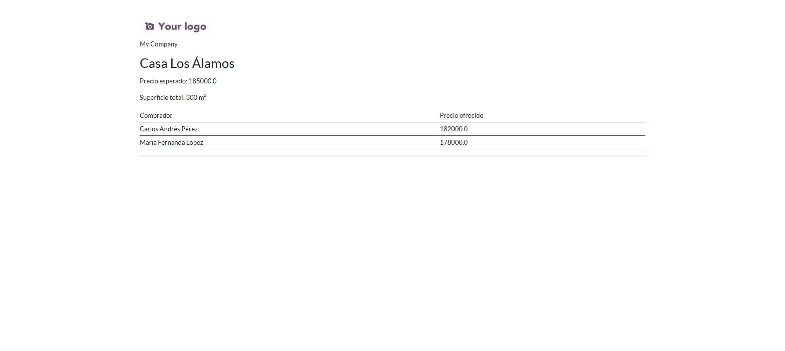

# Día 15 — QWeb y reportes PDF

**Semana:** 3 — Frontend, reportes e integraciones
**Duración estimada:** 3–4 h

## Objetivo del día
Generar un reporte PDF "Ficha de propiedad" y entender cómo Odoo lo convierte de HTML a PDF.

---

## Conceptos de Odoo

### QWeb: un motor de plantillas, usado en tres contextos distintos
QWeb es el motor de templates de Odoo (directivas `t-*` sobre XML). Se usa para tres cosas que comparten sintaxis pero no todo el contexto: reportes, páginas de website, y partes del cliente backend en JS (aunque ahí conviven con OWL). Hoy trabajás con la variante de **reportes**.

### El pipeline completo de un reporte PDF
1. Vos escribís una plantilla QWeb con HTML semántico.
2. Odoo la renderiza a HTML real, inyectando tus datos.
3. Si `report_type="qweb-pdf"`, Odoo pasa ese HTML por **wkhtmltopdf** (un binario externo que convierte HTML/CSS a PDF) para generar el archivo final.
4. Si en cambio pedís ver el reporte como HTML (`qweb-html` o la previsualización en el navegador), se salta el paso de wkhtmltopdf.

Esto explica por qué a veces un reporte se ve distinto en la previsualización HTML del navegador que en el PDF final — CSS avanzado o JS no siempre se comporta igual dentro de wkhtmltopdf.

### `docs`, no `doc`: por qué el `t-foreach` no es opcional
Cuando imprimís un reporte, Odoo puede recibir **varios** registros seleccionados a la vez (por ejemplo, tildar 5 propiedades en la lista y mandarlas todas a imprimir). Por eso el contexto que Odoo le pasa a tu plantilla es siempre `docs` — un recordset, en plural — nunca un `doc` singular ya resuelto. Sos vos quien decide cómo recorrerlo: `<t t-foreach="docs" t-as="doc">` itera una ficha completa por cada registro seleccionado, y recién ahí `doc` existe dentro de ese bloque. Si usás `doc.campo` sin haber abierto ese `t-foreach` primero, Odoo lanza `KeyError: 'doc'` — es el error más común al escribir el primer reporte.

### `web.html_container` + `web.external_layout`: por qué heredás de esto
No armás un reporte desde cero. `web.html_container` prepara el documento HTML base (head, viewport, etc.). `web.external_layout` agrega automáticamente el header/footer con el logo de la compañía, dirección, y demás datos configurados en `Ajustes → Empresas` — sin que vos tengas que codificarlo. Envolver tu contenido en ambos es lo que hace que tu reporte se vea "profesional" sin esfuerzo extra, y que cambie solo si la compañía cambia su logo.

### `t-out` reemplaza a `t-esc`
Desde Odoo 15, `t-out` es la forma recomendada de imprimir un valor con escape automático de HTML (evita que un nombre con caracteres especiales rompa el layout o permita inyección). `t-esc` sigue funcionando por compatibilidad, pero en código nuevo usá `t-out`. También existe `t-raw` para casos donde necesitás insertar HTML sin escapar (raro, y peligroso si el valor viene de input de usuario).

### `binding_model_id` + `binding_type`: cómo aparece en el menú "Imprimir" sin botón manual
Cuando un `ir.actions.report` tiene `binding_model_id` apuntando a tu modelo y `binding_type="report"`, Odoo lo agrega automáticamente al menú desplegable "Imprimir" del formulario de ese modelo — no necesitás escribir un botón vos mismo para invocarlo.

---

## Ejercicios prácticos

### Ejercicio 1 — Reporte básico (guiado)

`report/inmueble_property_report.xml`:
```xml
<odoo>
    <template id="report_inmueble_property_document">
        <t t-call="web.html_container">
            <t t-foreach="docs" t-as="doc">
                <t t-call="web.external_layout">
                    <div class="page">
                        <h2><t t-out="doc.name"/></h2>
                        <p>Precio esperado: <t t-out="doc.expected_price"/></p>
                        <p>Superficie total: <t t-out="doc.total_area"/> m²</p>
                    </div>
                </t>
            </t>
        </t>
    </template>

    <record id="action_report_inmueble_property" model="ir.actions.report">
        <field name="name">Ficha de propiedad</field>
        <field name="model">inmueble.property</field>
        <field name="report_type">qweb-pdf</field>
        <field name="report_name">gestion_inmobiliaria.report_inmueble_property_document</field>
        <field name="binding_model_id" ref="model_inmueble_property"/>
        <field name="binding_type">report</field>
    </record>
</odoo>
```
Agregalo a `data`, actualizá el módulo, generá el PDF desde una propiedad existente.

### Ejercicio 2 — Comparar HTML vs PDF del mismo reporte
1. Cambiá temporalmente `report_type` a `qweb-html` y regenerá — observá cómo se ve.
2. Volvé a `qweb-pdf` y compará: ¿algo se ve distinto? Prestá atención al header/footer que agrega `web.external_layout`.

### Ejercicio 3 — Provocar y corregir un error de escape
1. Creá una propiedad con un nombre que incluya un carácter especial de HTML, por ejemplo: `Casa <VIP>`.
2. Generá el reporte y confirmá que `t-out` lo escapa correctamente (se ve el texto literal, no se rompe el layout ni interpreta como HTML).
3. Como experimento, cambiá momentáneamente `t-out="doc.name"` por `t-raw="doc.name"` y regenerá — observá la diferencia (con `t-raw` el string se inserta sin escapar). Volvé a `t-out` al terminar — `t-raw` con datos de usuario es un riesgo real de inyección.

### Ejercicio 4 — Reporte sin `web.external_layout`
1. Creá una copia de prueba de la plantilla, pero sin el `t-call="web.external_layout"` (dejando solo `web.html_container` envolviendo tu `<div class="page">`).
2. Generá el PDF y compará: ¿qué información de la compañía (logo, dirección) desaparece?
3. Esto confirma qué te está dando exactamente ese layout heredado. Borrá la plantilla de prueba al terminar.

### Ejercicio 5 — Reto: listar las ofertas en el reporte
Iterá `doc.offer_ids` con `t-foreach` dentro del reporte para listar todas las ofertas recibidas, ordenadas por precio descendente:
```xml
<table>
    <t t-foreach="doc.offer_ids.sorted(key=lambda o: o.price, reverse=True)" t-as="offer">
        <tr>
            <td><t t-out="offer.partner_id.name"/></td>
            <td><t t-out="offer.price"/></td>
        </tr>
    </t>
</table>
```

---

## Preguntas de repaso conceptual

1. ¿Qué hace `wkhtmltopdf` en el pipeline de un reporte `qweb-pdf`, y en qué paso interviene?
2. ¿Qué te da concretamente heredar de `web.external_layout` que no tendrías si solo usaras `web.html_container`?
3. ¿Por qué `t-out` es preferible a `t-esc` en código nuevo, y qué hace distinto `t-raw`?
4. ¿Qué logran juntos `binding_model_id` y `binding_type="report"` en un `ir.actions.report`?
5. Si un reporte se ve distinto en la previsualización HTML que en el PDF final, ¿a qué paso del pipeline podría deberse la diferencia?
6. Si tu plantilla usa `doc.name` pero nunca abriste un `<t t-foreach="docs" t-as="doc">`, ¿qué error concreto vas a ver, y por qué?

<details>
<summary>Ver respuestas</summary>

1. Convierte el HTML ya renderizado (con los datos inyectados) a un archivo PDF real — es un binario externo invocado por Odoo, no parte del propio motor QWeb.
2. El header y footer automáticos con logo, nombre y dirección de la compañía, tomados de la configuración en `Ajustes → Empresas`, sin tener que codificarlos manualmente.
3. `t-out` escapa automáticamente el HTML del valor (previene que caracteres especiales rompan el layout o permitan inyección); `t-esc` es el nombre anterior con el mismo propósito, mantenido por compatibilidad; `t-raw` inserta el valor sin escapar, lo cual es riesgoso si el dato viene de input de usuario.
4. Que el reporte aparezca automáticamente en el menú desplegable "Imprimir" del formulario de ese modelo, sin necesidad de programar un botón manual para invocarlo.
5. Al paso de conversión por `wkhtmltopdf`: ese binario no siempre soporta CSS avanzado o JavaScript de la misma forma que un navegador moderno, por lo que el render final puede diferir de la previsualización HTML.
6. `KeyError: 'doc'` — porque Odoo solo te entrega `docs` (el recordset completo, en plural); `doc` no existe como variable hasta que vos mismo lo definís recorriendo `docs` con un `t-foreach`.

</details>

## Captura



## Checklist de cierre
- [ ] Entiendo qué aporta `web.external_layout` y lo confirmé sacándolo temporalmente.
- [ ] Sé la diferencia entre `qweb-pdf` y `qweb-html` como `report_type`.
- [ ] Sé por qué `t-out` es preferible a `t-esc`/`t-raw` en Odoo 18.
- [ ] Entiendo por qué el `t-foreach="docs" t-as="doc"` no es opcional.
- [ ] Agregué la tabla de ofertas al reporte.
