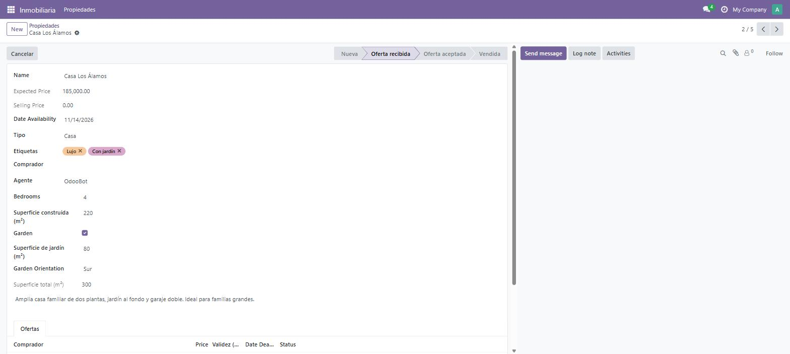

# Día 9 — Validaciones: constrains y onchange

**Semana:** 2 — Lógica de negocio y ORM avanzado
**Duración estimada:** 3–4 h

## Objetivo del día
Agregar una validación de servidor real y una sugerencia automática en el formulario, y entender por qué no son intercambiables.



---

## Conceptos de Odoo

### `@api.constrains`: la única validación que realmente protege tus datos
Corre en el servidor, dentro de la transacción de `create()`/`write()`, **siempre** — sin importar el origen de la llamada (UI, import CSV, XML-RPC, otro módulo, `odoo shell`). Si lanza `ValidationError`, toda la transacción hace rollback. Es tu única garantía real de integridad: cualquier validación que no esté acá puede saltearse.

### `@api.onchange`: solo mejora la experiencia, nunca protege datos
Corre **exclusivamente en el cliente**, cuando un usuario edita un campo dentro de un formulario abierto en el navegador:
- No se ejecuta si el registro se crea por código (`create()` desde otro método, un script, una importación).
- No se ejecuta si el usuario nunca llega a guardar — es puramente informativo/sugerido mientras se completa el formulario.
- Puede modificar **otros campos del mismo formulario todavía no guardado**, pero no puede tocar la base de datos directamente ni otros registros.

Si ponés tu única validación de "precio positivo" en un `onchange`, un import CSV con precio negativo pasa sin ningún problema — por eso siempre necesitás el `constrains` como respaldo, incluso si también tenés un `onchange` para mejorar la UX.

### `ValidationError` vs `UserError`
Ambas interrumpen la operación mostrando un mensaje al usuario, pero tienen matices de uso convencional:
- `ValidationError`: pensada para violaciones de una regla de integridad de datos (típicamente dentro de `@api.constrains`).
- `UserError`: pensada para errores de "esta acción no tiene sentido en este contexto" (por ejemplo, un botón que no debería poder ejecutarse en cierto estado).

Funcionalmente son intercambiables, pero seguir la convención ayuda a que el código comunique la intención.

### `_sql_constraints`: la validación más barata, con trade-offs
Una restricción a nivel base de datos (`CHECK`, `UNIQUE`) se evalúa directamente en PostgreSQL, sin ejecutar Python. Es más rápida y es imposible de saltear (ni siquiera un `sudo()` mal usado la evita). El trade-off: el mensaje de error es más genérico, y no podés expresar lógica compleja que involucre otros modelos — solo columnas del propio registro con operadores SQL.

---

## Ejercicios prácticos

### Ejercicio 1 — Constraint y onchange básicos (guiado)

```python
from odoo.exceptions import ValidationError
from odoo import api, fields, models


class InmuebleProperty(models.Model):
    _name = "inmueble.property"
    # ... campos ...

    @api.constrains("expected_price")
    def _check_expected_price(self):
        for record in self:
            if record.expected_price <= 0:
                raise ValidationError("El precio esperado debe ser positivo.")

    @api.onchange("garden")
    def _onchange_garden(self):
        if self.garden:
            self.garden_area = 10
            self.garden_orientation = "north"
        else:
            self.garden_area = 0
            self.garden_orientation = False
```
Actualizá el módulo, probá el `onchange` tildando/destildando "garden" sin guardar, y probá el `constrains` desde `odoo shell` intentando crear una propiedad con precio negativo.

### Ejercicio 2 — Demostrar que el `onchange` no protege nada
1. Comentá temporalmente el método `_check_expected_price` (dejá solo el `onchange`).
2. Desde `odoo shell` (no desde la UI), ejecutá:
   ```python
   env["inmueble.property"].create({"name": "Bypass test", "expected_price": -500})
   ```
3. Confirmá que se crea sin problema, con precio negativo — el `onchange` nunca se ejecutó porque no hubo interacción de UI.
4. Volvé a descomentar `_check_expected_price` y repetí el mismo `create()` — confirmá que ahora sí falla.

### Ejercicio 3 — `ValidationError` vs `UserError`
1. Cambiá temporalmente `_check_expected_price` para que lance `UserError` en vez de `ValidationError` (mismo mensaje).
2. Repetí la prueba del ejercicio 2 y confirmá que el comportamiento (bloquear la operación) es el mismo.
3. Volvé a `ValidationError` — es la convención correcta para este caso (regla de integridad de datos).

### Ejercicio 4 — Constraint con dos campos relacionados
1. Agregá una nueva validación: `selling_price` no puede ser menor al 90% de `expected_price` **una vez que ya está seteado** (es decir, solo validar si `selling_price != 0`).
2. Escribila con `@api.constrains("selling_price", "expected_price")`.
3. Probala creando una propiedad con `expected_price=100000` y forzando `selling_price=50000` vía `write()` desde shell — confirmá que falla.

### Ejercicio 5 — Reto: la alternativa SQL
Agregá, además del `constrains` en Python, la validación equivalente a nivel base de datos:
```python
_sql_constraints = [
    ("check_expected_price", "CHECK(expected_price > 0)", "El precio esperado debe ser positivo."),
]
```
- Compará el mensaje de error exacto que da cada mecanismo (Python vs SQL) al intentar la misma operación inválida.
- Decidí: para la regla "mayor a cero", ¿cuál de los dos dejarías como único mecanismo, y por qué? ¿Y para la regla que compara `selling_price` contra `expected_price` del ejercicio 4 — se podría expresar en SQL también, o no?

---

## Preguntas de repaso conceptual

1. ¿Por qué un `@api.onchange` nunca es suficiente como única validación de un dato crítico?
2. Dado un import CSV masivo con datos inválidos, ¿lo detendría un `@api.constrains`? ¿Y un `@api.onchange`?
3. ¿Qué diferencia de convención hay entre `ValidationError` y `UserError`, aunque ambas interrumpan la operación?
4. ¿Qué gana en velocidad y en seguridad un `_sql_constraints` frente a un `@api.constrains` en Python? ¿Qué pierde en expresividad?
5. ¿Puede un `@api.constrains` involucrar campos de un modelo relacionado (por ejemplo, algo del `buyer_id`), y podría un `_sql_constraints` hacer lo mismo?

<details>
<summary>Ver respuestas</summary>

1. Porque solo se ejecuta cuando un usuario interactúa con un formulario abierto en el navegador — cualquier creación/edición por código (imports, scripts, otros módulos) lo salta por completo.
2. Sí lo detendría el `@api.constrains` (corre siempre en `create`/`write`, sea cual sea el origen); el `@api.onchange` no participa en absoluto en un import — no hay formulario ni interacción de usuario de por medio.
3. `ValidationError` se usa por convención para violaciones de integridad de datos (constraints); `UserError` para acciones que no tienen sentido en el contexto actual (botones, transiciones de estado inválidas). Funcionalmente ambas interrumpen la operación igual.
4. Gana velocidad (lo evalúa PostgreSQL directamente, sin pasar por Python) y es imposible de saltear, ni con `sudo()`. Pierde expresividad: solo puede usar columnas del propio registro con operadores SQL, no puede navegar relaciones ni aplicar lógica de negocio compleja.
5. Sí, un `@api.constrains` en Python puede navegar relaciones libremente (por ejemplo, validar algo sobre `buyer_id.country_id`); un `_sql_constraints` no puede — está limitado a columnas de la propia tabla dentro de una expresión `CHECK`.

</details>

## Checklist de cierre
- [ ] Sé por qué un `onchange` no es suficiente como única validación.
- [ ] Demostré con un `create()` desde shell que el `onchange` no protege nada.
- [ ] Entiendo cuándo se dispara cada mecanismo (constrains, onchange, sql constraint).
- [ ] Puedo decidir, para un caso concreto, si conviene una validación en Python o en SQL.
