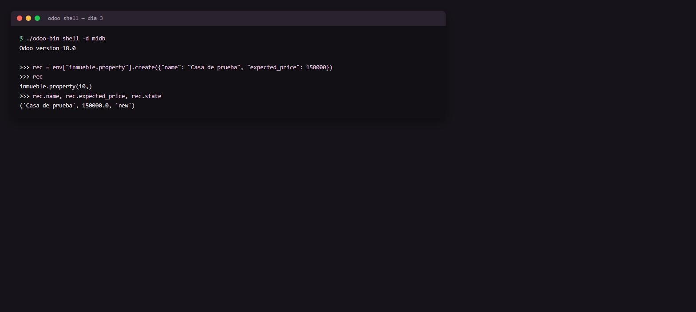

# Día 3 — ORM: modelos y campos básicos

**Semana:** 1 — Fundamentos y ORM básico
**Duración estimada:** 3–4 h

## Objetivo del día
Crear el modelo `inmueble.property` con sus campos básicos y entender cómo el ORM lo traduce a SQL.



---

## Conceptos de Odoo

### De clase Python a tabla SQL
Cuando declarás `_name = "inmueble.property"`, Odoo crea (al instalar/actualizar) una tabla `inmueble_property` (los puntos se vuelven guiones bajos). Cada `fields.X(...)` se vuelve una columna con un tipo SQL correspondiente: `Char` → `varchar`, `Integer` → `integer`, `Float` → `numeric` o `double precision` según configuración, `Boolean` → `boolean`, `Date`/`Datetime` → `date`/`timestamp`, `Selection` → `varchar` con los valores como strings (no un `enum` real de Postgres).

### Los campos que "vienen gratis"
Todo modelo tiene, sin que los declares:
- `id` (entero, autoincremental, clave primaria real).
- `create_date`, `create_uid` — cuándo y quién creó el registro.
- `write_date`, `write_uid` — cuándo y quién lo modificó por última vez.

Esto no es una convención: es parte del comportamiento base de `models.Model`. Nunca necesitás declarar un `id` manual.

### `required` vs `default`: no son lo mismo
- `required=True` es una restricción: el registro no se puede grabar sin ese valor. Se aplica tanto desde la UI como desde código.
- `default=...` es una conveniencia: si no se especifica el valor al crear, se usa ese. No impide que después quede vacío si alguien lo borra explícitamente (salvo que además sea `required`).
- `default` puede ser un valor fijo o un `lambda self: ...` — el lambda te da acceso al `env` (usuario actual, compañía actual, fecha actual), muy usado para valores como "agente = usuario que crea el registro".

### Selection: strings, no enums de base de datos
Un campo `Selection` en Python es una lista de tuplas `(valor_interno, etiqueta_visible)`. El valor que se guarda en la base es el string interno (`"new"`, `"sold"`, etc.), no un tipo enumerado real de PostgreSQL. Esto tiene una consecuencia práctica: si cambiás las opciones de un `Selection` en una actualización futura, los registros viejos con un valor que ya no existe en la lista **no se corrigen solos** — quedan con un string "huérfano" que no matchea ninguna etiqueta.

### `_description` no es cosmético
Aparece en mensajes de error del sistema, en el selector de "tipo de documento" al adjuntar archivos, y en varias pantallas técnicas. Ponerle una descripción clara ("Propiedad en venta" en vez de "Inmueble Property") ahorra confusión más adelante, sobre todo si el módulo crece.

---

## Ejercicios prácticos

### Ejercicio 1 — Crear el modelo (guiado)

```python
from odoo import fields, models


class InmuebleProperty(models.Model):
    _name = "inmueble.property"
    _description = "Propiedad en venta"

    name = fields.Char(required=True)
    description = fields.Text()
    postcode = fields.Char()
    date_availability = fields.Date(
        default=lambda self: fields.Date.add(fields.Date.today(), months=3)
    )
    expected_price = fields.Float(required=True)
    selling_price = fields.Float(readonly=True, copy=False)
    bedrooms = fields.Integer(default=2)
    living_area = fields.Integer(string="Superficie construida (m²)")
    facades = fields.Integer()
    garage = fields.Boolean()
    garden = fields.Boolean()
    garden_area = fields.Integer(string="Superficie de jardín (m²)")
    garden_orientation = fields.Selection(
        selection=[("north", "Norte"), ("south", "Sur"), ("east", "Este"), ("west", "Oeste")],
    )
    active = fields.Boolean(default=True)
    state = fields.Selection(
        selection=[
            ("new", "Nueva"),
            ("offer_received", "Oferta recibida"),
            ("offer_accepted", "Oferta aceptada"),
            ("sold", "Vendida"),
            ("cancelled", "Cancelada"),
        ],
        default="new",
        required=True,
        copy=False,
    )
```

Con `models/__init__.py`:
```python
from . import inmueble_property
```

Actualizá el módulo: `./odoo-bin -d midb -u gestion_inmobiliaria --stop-after-init`

### Ejercicio 2 — Inspeccionar la tabla real en PostgreSQL
1. Conectate a la base (`psql -h localhost -U odoo -d midb`, o `docker compose exec db psql -U odoo -d midb`).
2. Ejecutá `\d inmueble_property` y confirmá que cada campo Python tiene su columna correspondiente, con el tipo esperado.
3. Confirmá que `id`, `create_date`, `write_date` existen aunque no los declaraste.

### Ejercicio 3 — Crear registros desde `odoo shell`
```python
env["inmueble.property"].create({"name": "Casa de prueba", "expected_price": 150000})
env["inmueble.property"].create({"name": "Depto centro", "expected_price": 90000, "bedrooms": 1})
```
Después, probá crear uno **sin** `name` (que es `required`) y confirmá que Odoo lo rechaza.

### Ejercicio 4 — Probar el comportamiento de `default`
1. Creá una propiedad sin especificar `bedrooms` y confirmá que queda en 2 (el default).
2. Creá otra especificando `bedrooms=0` explícitamente, y confirmá que el `0` explícito **no** es reemplazado por el default (el default solo aplica cuando el valor está ausente, no cuando es "falsy").

### Ejercicio 5 — Reto: `_rec_name` y su efecto
1. Agregá `_rec_name = "postcode"` a la clase (temporalmente, como experimento).
2. Actualizá el módulo, y desde otro modelo con un `Many2one` hacia `inmueble.property` (podés probarlo desde `odoo shell` con `env["inmueble.property"].browse(id).display_name`), confirmá que ahora usa `postcode` en vez de `name` para mostrar el registro.
3. Volvé a sacar el `_rec_name` (o dejalo apuntando a `name`, que es el comportamiento por defecto).

---

## Preguntas de repaso conceptual

1. ¿Qué campos tiene todo modelo de Odoo sin necesidad de declararlos?
2. ¿Cuál es la diferencia práctica entre `required=True` y `default=valor`?
3. Un campo `Selection` con valores `[("new", "Nueva"), ("sold", "Vendida")]`, ¿qué tipo de dato usa realmente en PostgreSQL: un enum nativo o un string?
4. Si cambiás las opciones de un `Selection` en una actualización futura y sacás una opción vieja, ¿qué pasa con los registros que ya tenían ese valor guardado?
5. ¿Para qué sirve `_description` más allá de ser un comentario?

<details>
<summary>Ver respuestas</summary>

1. `id`, `create_date`, `create_uid`, `write_date`, `write_uid` — vienen incluidos por heredar de `models.Model`.
2. `required=True` bloquea el guardado si falta el valor (siempre); `default=valor` solo se aplica si no se pasó ningún valor al crear — no impide que después quede vacío (a menos que también sea `required`).
3. Usa un string (`varchar`) con el valor interno (`"new"`, `"sold"`); no existe un enum real a nivel PostgreSQL.
4. Quedan con ese string "huérfano" en la base de datos — no se corrigen automáticamente y pueden mostrarse vacíos o generar errores si el código asume que el valor siempre matchea una opción vigente.
5. Aparece en mensajes de error del sistema, en selectores de tipo de documento y en pantallas técnicas — ayuda a identificar el modelo con nombre legible en vez de su nombre técnico.

</details>

## Checklist de cierre
- [ ] Sé qué campos vienen "gratis" en todo modelo.
- [ ] Entiendo la diferencia entre `required=True` y `default=...`.
- [ ] Vi la tabla real generada en PostgreSQL, no solo el código Python.
- [ ] Puedo crear registros por código, sin pasar por la UI.
