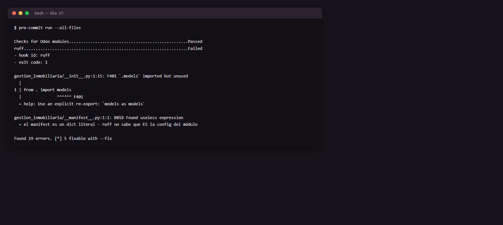

# Día 27 — Calidad de código y flujo de trabajo

**Semana:** 4 — Calidad, performance y profesionalización
**Duración estimada:** 2–3 h

## Objetivo del día
Poner linters específicos de Odoo a correr automáticamente antes de cada commit, y entender por qué un linter genérico no alcanza.



---

## Conceptos de Odoo

### Por qué un linter genérico (solo `ruff`/`flake8`) no detecta errores específicos de Odoo
Un linter Python estándar entiende sintaxis y estilo de Python en general, pero no conoce las convenciones semánticas de Odoo: no sabe que `cr.commit()` dentro de un módulo casi siempre rompe la atomicidad de la transacción que Odoo gestiona automáticamente (imaginate un `write()` a mitad de camino, con un `commit()` en el medio, y después una excepción — quedarías con datos parcialmente escritos e inconsistentes). `pylint-odoo` agrega reglas que entienden esas convenciones propias del framework: uso correcto de la API del ORM, estructura esperada de manifests, translation markers, y más.

### `cr.commit()`: por qué casi nunca es tu responsabilidad
Odoo envuelve cada request (o cada ejecución de cron) en una transacción que él mismo controla: si tu código lanza una excepción en cualquier punto, Odoo hace rollback de **todo** lo que pasó en esa transacción, dejando la base de datos consistente. Si vos llamás `cr.commit()` manualmente a mitad de tu lógica, estás partiendo esa garantía en pedazos — un fallo después de tu commit manual deja datos a medio camino, permanentemente. Hay casos legítimos y raros donde se necesita (por ejemplo, procesamiento por lotes muy largo donde necesitás persistir progreso parcial), pero es la excepción, no la norma.

### Traducción: por qué `_()` importa aunque tu módulo sea "solo para español"
Envolver strings de usuario en `_("texto")` no es sobre soportar múltiples idiomas hoy — es sobre dejar la puerta abierta para que Odoo pueda extraer esos strings a un archivo `.pot` y generar traducciones en el futuro, sin tener que revisar todo el código de nuevo. Además, ciertos strings (mensajes de error de validaciones, por ejemplo) se ven mucho más profesionales si están marcados para traducción, incluso en instalaciones monolingües, porque forma parte de la convención esperada por cualquiera que lea o mantenga el módulo después.

### `pre-commit`: mover la detección de errores lo más temprano posible
La filosofía de `pre-commit` es simple: cuanto antes detectás un problema (idealmente antes de que el commit siquiera se cree), más barato es corregirlo. Sin esto, dependés de acordarte de correr el linter manualmente, o de que lo detecte un CI varios minutos (u horas) después de que ya seguiste trabajando sobre ese código.

---

## Ejercicios prácticos

### Ejercicio 1 — Configurar `pre-commit` (guiado)

`.pre-commit-config.yaml`:
```yaml
repos:
  - repo: https://github.com/OCA/odoo-pre-commit-hooks
    rev: v0.0.33
    hooks:
      - id: oca-checks-odoo-module
  - repo: https://github.com/astral-sh/ruff-pre-commit
    rev: v0.6.9
    hooks:
      - id: ruff
        args: [--fix]
```
Instalá `pre-commit` (`pip install pre-commit`), corré `pre-commit install`, y ejecutá `pre-commit run --all-files` sobre tu módulo. Corregí lo que reporte.

### Ejercicio 2 — Provocar y detectar el error de `cr.commit()`
1. Agregá temporalmente un `self.env.cr.commit()` en algún método de negocio de `inmueble.property` (por ejemplo, dentro del método que acepta una oferta).
2. Corré `pre-commit run --all-files` y confirmá que `pylint-odoo` lo señala como problema.
3. Sacá esa línea y confirmá que el check pasa limpio.

### Ejercicio 3 — Marcar strings para traducción
1. Buscá en tu código (los `raise ValidationError(...)`, `raise UserError(...)` de días anteriores) los strings que **no** estén envueltos en `_()`.
2. Envolvelos: `raise ValidationError(_("El precio esperado debe ser positivo."))`.
3. Confirmá que necesitás importar `_` desde `odoo` (`from odoo import _`, o junto con el resto: `from odoo import _, api, fields, models`).

### Ejercicio 4 — Simular un CI local
1. Escribí un pequeño script (`check.sh` o similar) que corra, en secuencia: `pre-commit run --all-files`, y después los tests del día 22 (`--test-tags /gestion_inmobiliaria`).
2. Confirmá que el script falla con código de salida distinto de 0 si cualquiera de los dos pasos falla (esto es, en esencia, un pipeline de CI mínimo corriendo localmente).

### Ejercicio 5 — Reto: auditoría completa del módulo
Revisá todo el código de las semanas 1-3 buscando específicamente:
- [ ] Strings de usuario sin envolver en `_()` para traducción.
- [ ] Cualquier `print()` de debug olvidado.
- [ ] Métodos o modelos sin `_description`.
- [ ] Cualquier `cr.commit()` manual que no esté justificado.

Corregí todo lo que encuentres y volvé a correr `pre-commit run --all-files` para confirmar que queda limpio.

---

## Preguntas de repaso conceptual

1. ¿Qué tipo de errores detecta `pylint-odoo` que un linter Python genérico no puede detectar?
2. ¿Por qué llamar `cr.commit()` manualmente dentro de un método de negocio es riesgoso?
3. ¿Qué gana un módulo al envolver sus strings de usuario en `_()`, incluso si hoy solo se usa en un idioma?
4. ¿Cuál es la ventaja de `pre-commit` sobre "acordarme de correr el linter antes de subir el código"?
5. ¿En qué caso excepcional podría estar justificado un `cr.commit()` manual?

<details>
<summary>Ver respuestas</summary>

1. Errores relacionados a convenciones semánticas propias de Odoo: uso incorrecto de la API del ORM, manifests mal estructurados, gestión manual de transacciones (`cr.commit()`), ausencia de translation markers, entre otros — cosas que un linter Python genérico no tiene forma de conocer.
2. Porque parte la garantía de atomicidad que Odoo gestiona automáticamente por request/transacción: si algo falla después de ese commit manual, la base de datos queda con datos parcialmente escritos e inconsistentes, sin posibilidad de rollback completo.
3. Deja preparado el módulo para traducción futura sin tener que revisar todo el código de nuevo, y sigue la convención esperada por cualquiera que mantenga el módulo después, incluso si hoy solo se usa en un idioma.
4. Que la detección ocurre automáticamente en el momento del commit, sin depender de la memoria del desarrollador ni de esperar a que un CI remoto lo detecte minutos u horas después.
5. En procesamiento por lotes muy largo, donde perder todo el progreso ante un fallo tardío sería más costoso que aceptar la posibilidad de datos parcialmente procesados — un caso raro y que debería documentarse explícitamente en el código.

</details>

## Checklist de cierre
- [ ] `pre-commit` corriendo sin errores sobre `gestion_inmobiliaria`.
- [ ] Provoqué y corregí el error de `cr.commit()` manual.
- [ ] Marqué los strings de usuario pendientes con `_()`.
- [ ] Completé la auditoría del reto y quedó todo limpio.
