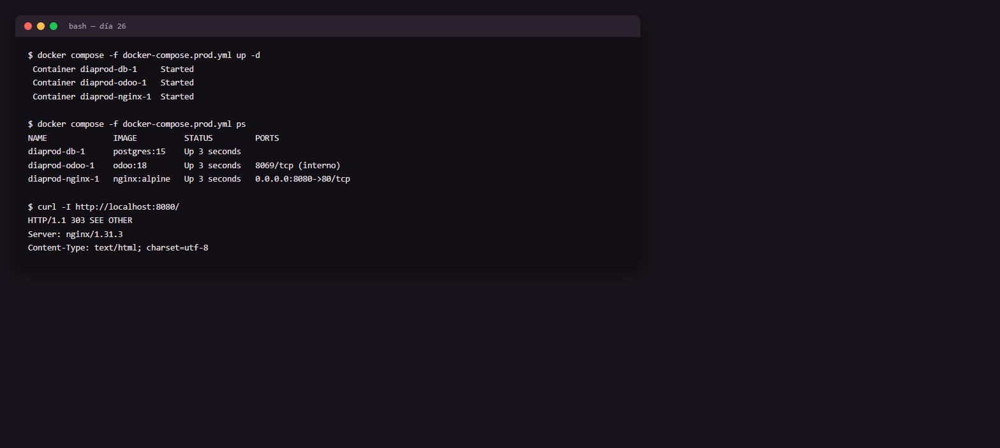

# Día 26 — Deployment y producción

**Semana:** 4 — Calidad, performance y profesionalización
**Duración estimada:** 3–4 h

## Objetivo del día
Armar un stack de producción con Nginx delante de Odoo, y entender por qué un entorno de producción no es "el mismo Docker Compose del día 1, pero con más RAM".



---

## Conceptos de Odoo

### Workers: por qué un solo proceso no alcanza en producción
Por defecto (`workers = 0`), Odoo corre en modo mono-hilo: un único proceso atiende todo, incluyendo cron jobs, de forma secuencial — perfectamente adecuado para desarrollo, inadecuado para producción con usuarios concurrentes. Con `workers > 0`, Odoo pasa a un modelo **multi-proceso**: un proceso maestro reparte requests HTTP entre varios workers, más procesos separados dedicados a cron (`max_cron_threads`) y a long-polling (notificaciones en tiempo real). Cada worker es un proceso Python independiente, no un hilo — esto rodea las limitaciones del GIL de Python para lograr concurrencia real.

### `proxy_mode`: confiar en los headers de un proxy
Cuando Nginx (u otro proxy) está delante de Odoo, la conexión que Odoo *ve* directamente viene del proxy, no del usuario final — la IP de origen, el protocolo (http/https) y el host real quedan "ocultos" detrás del proxy, a menos que este los reenvíe explícitamente vía headers (`X-Forwarded-For`, `X-Forwarded-Proto`, `X-Forwarded-Host`). `proxy_mode = True` le dice a Odoo "confiá en esos headers reenviados en vez de mirar la conexión directa" — sin esto, Odoo podría generar URLs incorrectas (http en vez de https) o registrar mal la IP de origen en los logs.

### Por qué el longpolling necesita su propio puerto/ruta
Las notificaciones en tiempo real (por ejemplo, un mensaje de chatter apareciendo sin recargar la página) usan una conexión de larga duración (WebSocket o long-polling), fundamentalmente distinta de una request HTTP normal de "pedido-respuesta rápida". Odoo separa esto en un puerto propio (8072 por defecto) para poder configurarlo con timeouts y comportamiento de proxy distintos al tráfico HTTP normal — mezclarlos en la misma configuración de proxy suele generar notificaciones que no llegan o conexiones que se cortan.

### Filestore: por qué un backup de solo la base de datos no alcanza
PostgreSQL guarda los **datos estructurados** (registros, campos), pero los archivos adjuntos (imágenes, PDFs subidos, documentos) se guardan en el sistema de archivos del servidor, en una carpeta llamada filestore (`/var/lib/odoo/filestore/<nombre_base>` dentro del contenedor, por convención). Un `pg_dump` de la base de datos **no incluye** estos archivos — son dos sistemas de almacenamiento distintos que hay que respaldar por separado, y restaurar solo uno sin el otro deja el sistema con referencias rotas (un registro que dice "tiene un archivo adjunto" pero el archivo físico no está).

### `admin_passwd`: no es la contraseña de ningún usuario
`admin_passwd` en `odoo.conf` es la contraseña **maestra** que protege operaciones a nivel de servidor completo (crear/borrar bases de datos desde el asistente web `/web/database/manager`), no la contraseña de ningún usuario de Odoo. Dejarla en un valor default o débil en producción es un riesgo de seguridad serio: cualquiera con esa contraseña podría borrar bases de datos completas.

---

## Ejercicios prácticos

### Ejercicio 1 — Stack completo con Nginx (guiado)

`odoo.conf`:
```ini
[options]
admin_passwd = cambiame
db_host = db
db_port = 5432
db_user = odoo
db_password = odoo
proxy_mode = True
workers = 4
max_cron_threads = 2
```

`nginx.conf` (fragmento):
```nginx
location / {
    proxy_pass http://odoo:8069;
    proxy_set_header Host $host;
    proxy_set_header X-Forwarded-Host $host;
    proxy_set_header X-Forwarded-For $proxy_add_x_forwarded_for;
    proxy_set_header X-Forwarded-Proto $scheme;
}
location /websocket {
    proxy_pass http://odoo:8072;
    proxy_set_header Upgrade $http_upgrade;
    proxy_set_header Connection "upgrade";
}
```
Armá el `docker-compose` completo (Odoo + Postgres + Nginx) con estos archivos, y probá acceder vía Nginx en vez de directo al puerto 8069.

### Ejercicio 2 — Ver el efecto de `proxy_mode` desactivado
1. Poné `proxy_mode = False` (o comentalo) y reiniciá.
2. Accedé vía Nginx igual, y revisá los logs de Odoo — comparé la IP de origen registrada contra la real de tu máquina (¿ahora ve la IP interna de Nginx en vez de la tuya?).
3. Volvé a `proxy_mode = True` y confirmá que la IP registrada vuelve a ser la correcta.

### Ejercicio 3 — Confirmar la separación de longpolling
1. Comentá temporalmente el bloque `location /websocket` del `nginx.conf`.
2. Abrí Odoo en dos pestañas del navegador, logueadas como usuarios distintos, y probá si las notificaciones en tiempo real (por ejemplo, un mensaje de chatter) siguen llegando sin recargar.
3. Restaurá el bloque `/websocket` y repetí la prueba, confirmando la diferencia.

### Ejercicio 4 — Workers en la práctica
1. Con `workers = 0`, generá carga simple (varias pestañas navegando simultáneamente) y notá si alguna acción se siente "bloqueada" mientras otra corre.
2. Cambiá a `workers = 2` (ajustado a los recursos de tu máquina), reiniciá, y repetí la prueba de carga.
3. No hace falta una medición formal — el objetivo es notar la diferencia cualitativa de responsividad con múltiples usuarios concurrentes.

### Ejercicio 5 — Reto: backup completo (base + filestore)
Escribí un script de backup que:
- Haga `pg_dump` de la base.
- Copie la carpeta de filestore (`/var/lib/odoo/filestore/<dbname>` dentro del contenedor de Odoo) a un destino externo.
- Ambos con timestamp en el nombre del archivo/carpeta de destino, para poder mantener varias versiones.

Probá restaurar ambos en una base de datos nueva y confirmá que un archivo adjunto subido antes del backup se puede volver a abrir correctamente después de la restauración.

---

## Preguntas de repaso conceptual

1. ¿Por qué un solo worker (modo por defecto) no es adecuado para producción con usuarios concurrentes?
2. ¿Qué problema resuelve `proxy_mode = True`, y qué pasa si Nginx está delante de Odoo pero esta opción queda desactivada?
3. ¿Por qué el longpolling necesita un puerto o ruta separada de las requests HTTP normales?
4. ¿Por qué un backup de solo `pg_dump` no es suficiente para restaurar completamente un sistema Odoo en producción?
5. ¿Qué protege exactamente `admin_passwd`, y por qué no es "la contraseña de un usuario"?

<details>
<summary>Ver respuestas</summary>

1. Porque un único proceso atiende todo secuencialmente (requests HTTP, cron, longpolling); con usuarios concurrentes reales, las operaciones empiezan a bloquearse unas a otras, degradando la experiencia — `workers > 0` distribuye la carga entre varios procesos independientes.
2. Resuelve que Odoo confíe en los headers reenviados por el proxy (`X-Forwarded-*`) para saber la IP real de origen, el protocolo y el host, en vez de ver solo la conexión directa del proxy. Sin esto, Odoo puede generar URLs incorrectas (http en vez de https) o registrar mal la IP de origen.
3. Porque es una conexión de larga duración (WebSocket/long-polling) con necesidades de timeout y configuración de proxy distintas a una request HTTP normal de pedido-respuesta rápida — mezclarlas en la misma configuración suele causar que las notificaciones no lleguen o se corten.
4. Porque los archivos adjuntos (imágenes, PDFs subidos) se guardan en el filesystem del servidor (filestore), no en la base de datos — un `pg_dump` no los incluye, y restaurar solo la base deja referencias a archivos que no existen físicamente.
5. Protege operaciones a nivel de servidor completo, como crear o borrar bases de datos enteras desde el asistente web (`/web/database/manager`) — no es la contraseña de ningún usuario de Odoo específico, sino una clave maestra administrativa del servidor.

</details>

## Checklist de cierre
- [ ] Sé por qué `proxy_mode = True` es necesario detrás de Nginx, y lo confirmé desactivándolo.
- [ ] Entiendo por qué el longpolling necesita su propia ruta/puerto, y lo confirmé rompiéndolo a propósito.
- [ ] Sé por qué un backup de solo la base de datos no alcanza.
- [ ] Probé una restauración completa (base + filestore) y confirmé que un adjunto sigue accesible.
