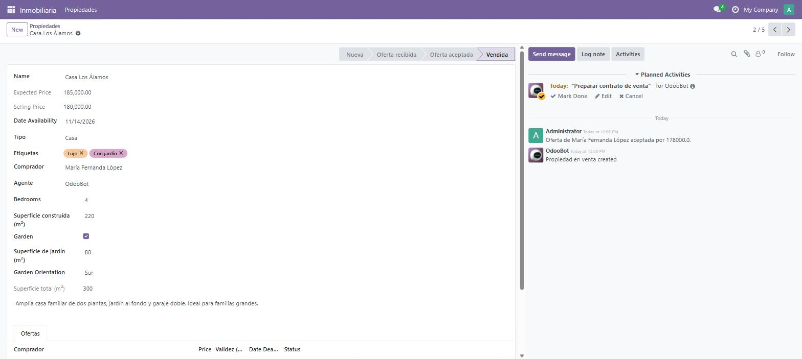

# Día 30 — Proyecto final y plan de crecimiento continuo

**Semana:** 4 — Calidad, performance y profesionalización
**Duración estimada:** 3–4 h

## Objetivo del día
Demo de punta a punta del módulo completo, validar que está listo para mostrarse, y trazar el plan de qué seguir aprendiendo.

---

## Conceptos de Odoo (síntesis de las 4 semanas)

### El hilo conductor de todo el curso
Cada semana construyó sobre una misma idea central: **la UI ayuda, el servidor protege**. Lo viste en `@api.onchange` vs `@api.constrains` (día 9), en `invisible` de un botón vs la validación dentro del método (día 14), en `sudo()` en un controlador público (día 17), y en que la seguridad vía XML-RPC respeta las mismas reglas que la UI (día 19). Cualquier decisión de diseño que tomes de acá en adelante en Odoo, conviene revisarla contra esta pregunta: "¿esto es una ayuda de experiencia, o una garantía real?".

### Por qué el patrón "un módulo, muchas piezas" escala
`gestion_inmobiliaria` terminó con modelos, vistas, seguridad, wizards, reportes, un widget OWL, un controlador de website, y tests — todo coexistiendo en la misma estructura de carpetas que armaste el día 2. Ese es, literalmente, el patrón de cualquier módulo Odoo real, sin importar su tamaño: la complejidad crece agregando piezas del mismo tipo, no cambiando la arquitectura de base.

### Lo que un tutorial no puede enseñarte: criterio
Las 30 preguntas de repaso a lo largo de esta guía apuntaron a que entendieras el "por qué" detrás de cada decisión, no solo el "cómo" de copiar código que funciona. Ese criterio — decidir cuándo `store=True` vale la pena, cuándo un wizard es la herramienta correcta, cuándo `sudo()` es legítimo — es lo que distingue a un desarrollador que reproduce patrones de uno que los adapta a problemas nuevos que ningún tutorial cubrió.

---

## Ejercicio guiado — demo de punta a punta

1. Crear una propiedad nueva.
2. Recibir 2-3 ofertas de distintos contactos.
3. Aceptar la mejor oferta.
4. Confirmar la venta con el wizard (precio final).
5. Verificar el mensaje y la actividad en el chatter.
6. Imprimir el reporte PDF de la ficha.
7. Crear la misma propiedad vía el script XML-RPC del día 19, para confirmar que la vía externa respeta las mismas validaciones que la UI.
8. Navegar `/propiedades` sin sesión iniciada y confirmar que la propiedad nueva aparece si está en un estado disponible.

## Checklist "¿listo para producción?"
- [ ] Seguridad revisada (ACL + record rules probadas con usuarios reales, no solo con admin).
- [ ] Tests pasando (`--test-tags /gestion_inmobiliaria`).
- [ ] `pre-commit` corriendo limpio (día 27).
- [ ] Sin `print()` de debug ni código comentado "por las dudas".
- [ ] Manifest con `depends` completo y versión actualizada.
- [ ] README publicado, con decisiones de diseño explicadas.

## Autoevaluación final — repaso integrador (elegí 10 al azar y respondé sin mirar los días anteriores)

1. ¿Por qué una regla de negocio escrita solo en JavaScript no es una garantía de seguridad real?
2. ¿Qué diferencia hay entre ACL y record rule?
3. ¿Cuál es la diferencia entre `Many2one`, `One2many` y `Many2many` en términos de qué tabla guarda la relación?
4. ¿Cuándo conviene `store=True` en un campo computado, y cuándo no?
5. ¿Por qué un `@api.onchange` nunca es suficiente como única validación?
6. ¿Cuándo usarías `_inherit` solo y cuándo `_inherits`?
7. ¿Qué gana un modelo al heredar `mail.thread`?
8. ¿Por qué el ORM prefetchea, y qué patrón de código rompe esa optimización?
9. ¿Qué diferencia hay entre `pre-migrate` y `post-migrate`?
10. ¿Por qué un backup de solo la base de datos no alcanza en producción?

Ver respuestas

1. Porque el cliente JS corre en la máquina del usuario, fuera de tu control — cualquiera puede saltarse el navegador y hablar directo con el servidor.
2. El ACL decide si un grupo puede operar sobre un modelo en general; la record rule filtra qué filas concretas puede ver/tocar el usuario dentro de lo que el ACL ya permitió.
3. `Many2one` guarda una FK en la tabla propia; `One2many` no guarda nada (consulta calculada sobre el `Many2one` inverso); `Many2many` crea una tabla intermedia con dos FK.
4. Conviene cuando necesitás filtrar/ordenar por ese campo con `search()`; no conviene si el campo cambia muy seguido y rara vez se busca, porque cada cambio de dependencia implica una escritura extra.
5. Porque solo corre en interacción real de formulario en el navegador — cualquier creación/edición por código (imports, scripts, otros módulos) lo salta completamente.
6. `_inherit` solo cuando extendés un modelo existente in-place; `_inherits` cuando tu modelo necesita tabla propia pero quiere reutilizar por composición todos los campos de otro modelo, vía un `Many2one` obligatorio.
7. Historial de mensajes, seguidores, y el método `message_post()` para dejar registro de eventos relevantes en el chatter del registro.
8. Prefetchea para traer un campo de todo un recordset en una sola consulta en vez de una por registro; se rompe con patrones que disparan consultas nuevas dentro de un loop en vez de trabajar sobre el recordset completo.
9. `pre-migrate` corre antes de que el esquema se sincronice (solo SQL crudo disponible); `post-migrate` corre después, con el ORM completo ya disponible.
10. Porque los archivos adjuntos viven en el filestore del sistema de archivos, no en la base de datos — un `pg_dump` no los incluye, y restaurar solo la base deja referencias rotas a archivos inexistentes.

## Plan post-30-días
- [ ] Elegir una especialización: Accounting, Manufacturing, Inventory, POS o Website/eCommerce.
- [ ] Leer el código fuente de ese módulo core de Odoo 18 — es la mejor fuente de patrones avanzados reales, más allá de cualquier tutorial.
- [ ] Volver a hacer, sin mirar esta guía, el ejercicio de integración de la semana 1 (día 7) para confirmar retención a largo plazo.

## Comunidad para seguir aprendiendo
- Documentación oficial — `odoo.com/documentation/18.0`
- Foro oficial — `odoo.com/forum`
- Código fuente e issues — `github.com/odoo/odoo`
- Runbot (builds e instancias de prueba) — `runbot.odoo.com`
- Odoo Community Association — `github.com/OCA`

## Cierre
- [ ] Completé la demo de punta a punta sin errores.
- [ ] El módulo cumple el checklist "¿listo para producción?".
- [ ] Respondí correctamente al menos 8 de las 10 preguntas de repaso integrador sin mirar días anteriores.
- [ ] Tengo definida mi próxima especialización.
