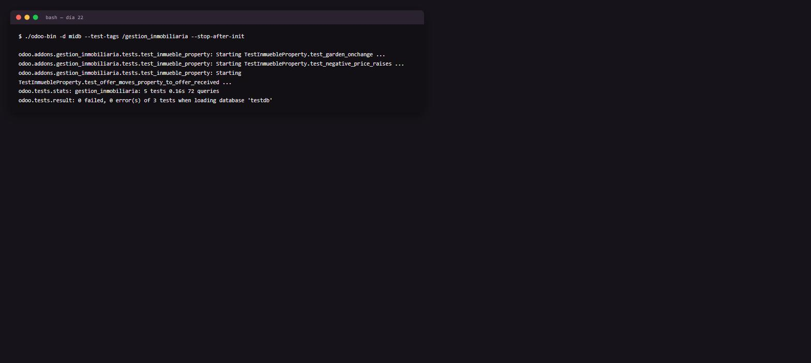

# Día 22 — Testing

**Semana:** 4 — Calidad, performance y profesionalización
**Duración estimada:** 3–4 h

## Objetivo del día
Escribir tests automáticos para las reglas de negocio del módulo, y entender qué garantizan realmente.



---

## Conceptos de Odoo

### Por qué `TransactionCase` no ensucia tu base de datos de desarrollo
Cada método de test corre dentro de su propia transacción de PostgreSQL, que Odoo **revierte** (rollback) al finalizar el test, se haya o no lanzado una excepción. Esto significa que podés crear, modificar y borrar registros libremente dentro de un test sin preocuparte por dejar datos residuales — es como si nada de eso hubiera pasado, desde la perspectiva de la base de datos real.

### Qué garantiza (y qué no) un test que pasa
Un test verde confirma que, **para ese escenario específico**, el comportamiento es el esperado. No garantiza que no haya bugs en escenarios no cubiertos, ni que el comportamiento sea correcto desde el punto de vista del negocio (podés tener un test que confirma perfectamente un comportamiento incorrecto, si el test mismo está mal planteado). Los tests son una red de seguridad para **cambios futuros** — te avisan si algo que funcionaba dejó de funcionar, no certifican que el diseño sea el correcto.

### `Form`: simular la UI sin un navegador
Crear un registro con `env["modelo"].create({...})` **salta todos los `@api.onchange`** — porque, como viste el día 9, los onchange solo corren en interacción de formulario real. `Form` es un helper que sí simula ese comportamiento: al asignar `f.campo = valor`, dispara los onchange correspondientes como lo haría el navegador, permitiéndote testear esa lógica sin Selenium ni un navegador real.

### `--test-tags`: filtrar qué corre
Por default, Odoo tiene tags implícitos como `standard` (tests que corren siempre), `at_install` (corren automáticamente después de instalar cada módulo) y `post_install` (corren después de que **todos** los módulos de la instalación terminaron de instalarse, útil para tests que dependen de la interacción entre módulos). `--test-tags /nombre_modulo` filtra para correr solo los tests de tu módulo, sin ejecutar la suite completa de Odoo (que sería enormemente lenta).

### Por qué los tests son parte de "profesionalizar" el módulo, no un extra opcional
Un módulo sin tests puede funcionar hoy y romperse silenciosamente en la próxima actualización de Odoo, o cuando otro desarrollador (o vos mismo, meses después) toque una parte relacionada del código sin saber que afecta a otra. Los tests documentan comportamiento esperado de forma ejecutable — mucho más confiable que un comentario que puede quedar desactualizado.

---

## Ejercicios prácticos

### Ejercicio 1 — Tests básicos (guiado)

`tests/__init__.py`:
```python
from . import test_inmueble_property
```

`tests/test_inmueble_property.py`:
```python
from odoo.exceptions import ValidationError
from odoo.tests.common import TransactionCase


class TestInmuebleProperty(TransactionCase):
    def test_negative_price_raises(self):
        with self.assertRaises(ValidationError):
            self.env["inmueble.property"].create(
                {"name": "Inválida", "expected_price": -100}
            )

    def test_offer_moves_property_to_offer_received(self):
        property_rec = self.env["inmueble.property"].create(
            {"name": "Casa test", "expected_price": 100000}
        )
        partner = self.env["res.partner"].create({"name": "Comprador Test"})
        self.env["inmueble.property.offer"].create(
            {"property_id": property_rec.id, "partner_id": partner.id, "price": 95000}
        )
        self.assertEqual(property_rec.state, "offer_received")
```
```bash
./odoo-bin -d midb --test-tags /gestion_inmobiliaria --stop-after-init
```

### Ejercicio 2 — Confirmar el rollback entre tests
1. Agregá un tercer test que cree 3 propiedades y haga `self.env["inmueble.property"].search_count([])`, imprimiendo (o guardando en una variable de aserción) ese número.
2. Corré los tests dos veces seguidas.
3. Confirmá que el conteo da lo mismo ambas veces (no se acumulan propiedades de una corrida a la siguiente) — eso demuestra el rollback automático entre ejecuciones de test.

### Ejercicio 3 — Probar `Form` para simular el onchange del día 9
```python
from odoo.tests import Form

def test_garden_onchange(self):
    with Form(self.env["inmueble.property"]) as f:
        f.name = "Con jardín"
        f.garden = True
        self.assertEqual(f.garden_area, 10)
        self.assertEqual(f.garden_orientation, "north")
```
Agregalo, corré los tests, y confirmá que pasa. Después, comentá temporalmente el método `_onchange_garden` en el modelo y volvé a correr — confirmá que el test ahora falla, demostrando que realmente está probando ese comportamiento.

### Ejercicio 4 — Test que falla a propósito, y por qué eso es útil
1. Escribí un test que verifique algo intencionalmente incorrecto (por ejemplo, `self.assertEqual(property_rec.state, "sold")` justo después de crear una propiedad nueva, que debería estar en `"new"`).
2. Corré los tests y leé el mensaje de error completo que da `assertEqual` al fallar.
3. Corregí el test al valor correcto y confirmá que pasa — este ejercicio es para que aprendas a leer un output de test fallido con confianza, no solo a escribir tests que siempre pasan.

### Ejercicio 5 — Reto: test de la validación de precio mínimo del wizard
Del reto del día 12 (`final_price` no puede ser menor al 90% de `expected_price`), escribí un test que:
1. Cree una propiedad con `expected_price=100000`.
2. Cree un wizard con `final_price=50000` (por debajo del 90%).
3. Confirme con `assertRaises` que `action_confirm_sale()` lanza la excepción esperada.

---

## Preguntas de repaso conceptual

1. ¿Por qué correr un test dos veces seguidas no acumula datos de la corrida anterior?
2. ¿Qué garantiza exactamente un test que pasa, y qué NO garantiza?
3. ¿Por qué `env["modelo"].create({...})` no dispara los `@api.onchange`, y qué herramienta sí los simula?
4. ¿Qué diferencia hay entre los tags `at_install` y `post_install`?
5. ¿Por qué `--test-tags /nombre_modulo` es preferible a correr la suite completa de tests de Odoo durante el desarrollo?

<details>
<summary>Ver respuestas</summary>

1. Porque `TransactionCase` envuelve cada test en su propia transacción de base de datos, que se revierte (rollback) automáticamente al finalizar, sin importar si el test pasó o falló.
2. Garantiza que, para el escenario específico que el test ejercita, el comportamiento observado coincide con lo esperado. No garantiza ausencia de bugs en escenarios no cubiertos, ni que el diseño sea correcto desde el punto de vista de negocio si el test mismo está mal planteado.
3. Porque los `@api.onchange` solo se disparan en interacción real de formulario (edición de un campo por un usuario en el navegador), no en una creación programática; `Form` es el helper que simula esa interacción, disparando los onchange correspondientes al asignar valores.
4. `at_install` corre justo después de instalar/actualizar ese módulo específico; `post_install` corre después de que toda la instalación (todos los módulos involucrados) terminó, útil para tests que dependen de interacción entre módulos.
5. Porque correr la suite completa de Odoo es enormemente más lento (miles de tests de todos los módulos core); filtrar por tu módulo te da feedback rápido durante el desarrollo, dejando la suite completa para CI o validaciones más exhaustivas.

</details>

## Checklist de cierre
- [ ] Sé por qué `TransactionCase` no requiere limpiar datos manualmente, y lo confirmé corriendo tests dos veces.
- [ ] Entiendo qué simula `Form` que un test común no puede, y lo demostré rompiendo el onchange a propósito.
- [ ] Corrí los tests yo mismo y leí un mensaje de fallo completo, no solo uno de éxito.
- [ ] Escribí el test del reto sobre la validación del wizard.
