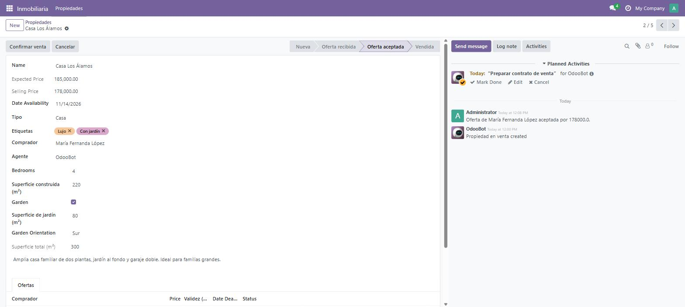

# Día 14 — Máquina de estados y repaso de la semana 2

**Semana:** 2 — Lógica de negocio y ORM avanzado
**Duración estimada:** 3–4 h

## Objetivo del día
Cerrar el flujo completo de estados de una propiedad, y consolidar toda la semana 2.



---

## Conceptos de Odoo

### El patrón de "campo state + botones condicionados"
Es el patrón más usado en todo Odoo (lo vas a ver en ventas, compras, inventario, todo) para modelar un flujo de negocio con pasos claros:
- Un campo `Selection` llamado `state`, con valores que representan cada etapa.
- Uno o más botones que ejecutan una transición (cambian `state` y opcionalmente hacen más cosas).
- Cada botón visible **solo** en los estados donde tiene sentido, usando `invisible="state not in (...)"` o `invisible="state != '...'"`.

Esto evita que un usuario dispare una transición inválida (por ejemplo, "aceptar oferta" en una propiedad que ya está vendida) directamente desde la interfaz, sin necesidad de validación adicional para el caso normal de uso.

### Por qué la UI no alcanza como única protección
Ocultar un botón con `invisible` es una ayuda de UX, **no una validación de servidor**. Un usuario que llama al método directamente (por XML-RPC, por ejemplo) puede ejecutar `action_cancel()` sobre una propiedad vendida sin pasar por ningún botón. Por eso el método en sí también valida (`if record.state == "sold": raise UserError(...)`), igual que viste el día 9 con `onchange` vs `constrains` — la UI ayuda, el servidor protege.

### `invisible` vs `readonly` en la sintaxis directa de Odoo 18
Ambos se escriben igual (expresión Python sobre campos del registro), pero significan cosas distintas:
- `invisible="condición"` oculta el elemento por completo.
- `readonly="condición"` lo muestra pero no permite editarlo.

Podés combinarlos en el mismo campo si hace falta (mostrar mientras es de solo lectura en algunos estados, y editable en otros).

### `statusbar_visible`: guiar visualmente sin restringir
El widget `statusbar` en el campo `state` no impide ningún valor — solo decide **cuáles mostrar como pasos del progreso visual** (`statusbar_visible="new,offer_received,offer_accepted,sold"` deja fuera a `cancelled` de la barra normal, porque es una salida alternativa, no un paso del camino principal). El campo puede seguir teniendo cualquier valor de su `Selection` completo.

---

## Ejercicios prácticos

### Ejercicio 1 — Botones condicionados por estado (guiado)

```xml
<header>
    <button string="Cancelar" type="object" name="action_cancel"
            invisible="state in ('sold', 'cancelled')"/>
    <field name="state" widget="statusbar"
           statusbar_visible="new,offer_received,offer_accepted,sold"/>
</header>
```
```python
def action_cancel(self):
    for record in self:
        if record.state == "sold":
            raise UserError("No se puede cancelar una propiedad vendida.")
        record.state = "cancelled"
```

### Ejercicio 2 — Flujo completo de transiciones
Implementá las 4 transiciones y probalas en orden, sobre una propiedad de prueba:
1. `new` → `offer_received`: automático al crear la primera `inmueble.property.offer` (sobreescribí `create` en ese modelo para hacer `self.property_id.state = "offer_received"` sobre la propiedad correspondiente).
2. `offer_received` → `offer_accepted`: desde el método de aceptar oferta.
3. `offer_accepted` → `sold`: desde el wizard del día 12.
4. Cualquier estado (salvo `sold`) → `cancelled`: con el botón de arriba.

### Ejercicio 3 — Probar el bypass de UI y confirmar que el servidor protege
1. Llevá una propiedad hasta `state="sold"` por el flujo normal.
2. Desde `odoo shell` (simulando lo que haría alguien saltándose la UI), ejecutá directamente:
   ```python
   env["inmueble.property"].browse(ID).action_cancel()
   ```
3. Confirmá que lanza `UserError` igual, aunque no hayas pasado por ningún botón — la protección real está en el método, no en el `invisible` del botón.

### Ejercicio 4 — `readonly` condicionado
1. Agregá `readonly="state != 'new'"` al campo `expected_price` en la vista formulario — una vez que la propiedad avanzó de estado, el precio esperado ya no debería poder tocarse.
2. Probá editar `expected_price` en una propiedad `new` (debería poder) y en una `offer_received` (no debería poder desde la UI).

### Ejercicio 5 — Reto: agregar un estado intermedio
- Agregá un nuevo valor al `Selection` de `state`: `"under_contract"` (bajo contrato), entre `offer_accepted` y `sold`.
- Ajustá `statusbar_visible` para incluirlo.
- Decidí (y justificá) en qué punto del flujo del wizard debería activarse este nuevo estado, y ajustá el código.

---

## Repaso de la semana 2

1. ¿Cuándo usarías `_inherit` solo y cuándo `_inherits`?
2. ¿Por qué un wizard no persiste datos salvo que vos mismo los escribas en otro modelo dentro del método del botón?
3. ¿Qué diferencia hay entre `@api.constrains` y `@api.onchange` en cuanto a cuándo se disparan?
4. ¿Qué gana un modelo al heredar `mail.thread`?
5. ¿Por qué ocultar un botón con `invisible` no reemplaza una validación en el método que ejecuta?
6. ¿Qué diferencia hay entre `store=True` y `store=False` en un campo computado?

<details>
<summary>Ver respuestas</summary>

1. `_inherit` solo cuando querés extender un modelo existente in-place (mismo tabla, mismos registros, más campos/métodos); `_inherits` cuando tu modelo necesita su propia tabla pero quiere reutilizar por composición todos los campos de otro modelo relacionado obligatoriamente.
2. Porque un `TransientModel` es solo el vehículo para capturar input temporal — la lógica de negocio real (escribir en otro modelo) tiene que estar explícita en el método del botón; sin ese `write()`, nada persiste más allá del propio wizard (que además se purga solo).
3. `@api.constrains` corre siempre en el servidor durante `create`/`write`, sin importar el origen; `@api.onchange` corre solo en el cliente, cuando un usuario edita un campo en un formulario abierto, y nunca se ejecuta en creaciones por código.
4. Historial de mensajes (`message_ids`), seguidores (`message_follower_ids`) y el método `message_post()` para dejar registro de eventos relevantes en el chatter.
5. Porque `invisible` es solo una ayuda de interfaz — cualquiera que llame al método directamente (por código, por XML-RPC) se lo salta; la validación real tiene que estar dentro del método mismo.
6. `store=True` graba el resultado como columna real (permite `search()`/`sort()` eficiente, con costo de escritura en cada cambio de dependencia); `store=False` lo recalcula en memoria cada vez que se lee, sin ocupar espacio pero sin poder filtrarlo eficientemente.

</details>

## Estado esperado del módulo al cierre de la semana 2
- [ ] Campos computados (`total_area`, `best_price`) funcionando.
- [ ] Validaciones de precio (constraint + SQL constraint).
- [ ] Smart button de propiedades en `res.partner`.
- [ ] Wizard de confirmación de venta.
- [ ] Chatter y notificación automática al aceptar oferta.
- [ ] Máquina de estados completa con botones condicionados y protección en el servidor.
